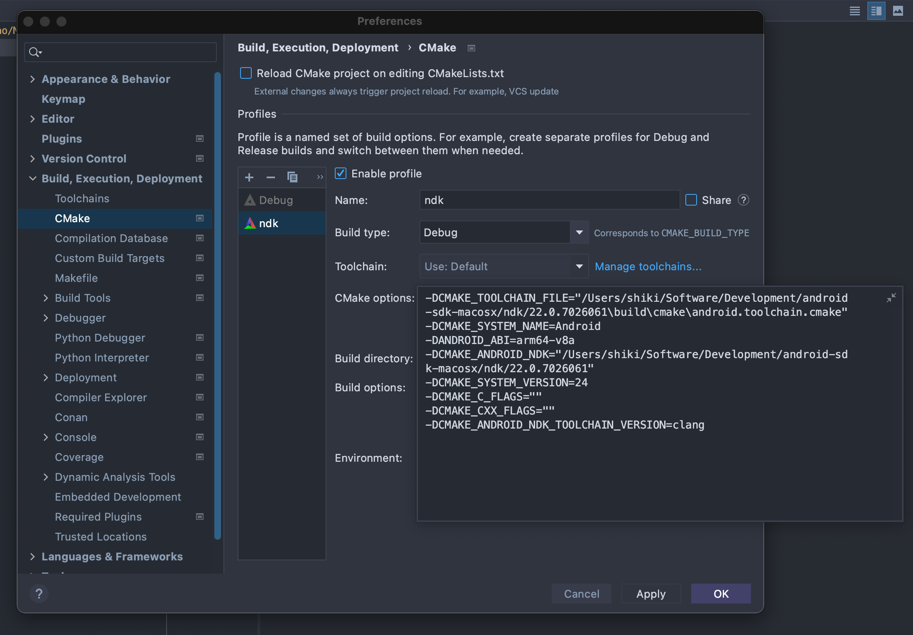

### 参考 <mark>字节流动</mark> 的[NDK_OpenGLES_3_0](https://github.com/githubhaohao/NDK_OpenGLES_3_0) 基于c++为主的OpenGL自学项目

### 主要使用CLion开发(mac osx系统),需要在Preferences->Build,Execution,Deployment->CMake 添加一个ndk配置并且配置相关参数,也可以使用Android studio导入在 [platforms/android]项目(./platforms/android)

```shell
-DCMAKE_TOOLCHAIN_FILE="ndk的android.toolchain.cmake路径"
-DCMAKE_SYSTEM_NAME=Android
-DANDROID_ABI=arm64-v8a
-DCMAKE_ANDROID_NDK="ndk的路径"
-DCMAKE_SYSTEM_VERSION=24
-DCMAKE_C_FLAGS=""
-DCMAKE_CXX_FLAGS=""
-DCMAKE_ANDROID_NDK_TOOLCHAIN_VERSION=clang
```

### 参考图:



### 资源准备:
需要安装ffmpeg

jpg转nv21

```shell
ffmpeg -i test02.jpg -pix_fmt nv21 test02.yuv
```

jpg转nv12

```shell
ffmpeg -i test03.jpg -pix_fmt nv12 test03_nv12.yuv
```